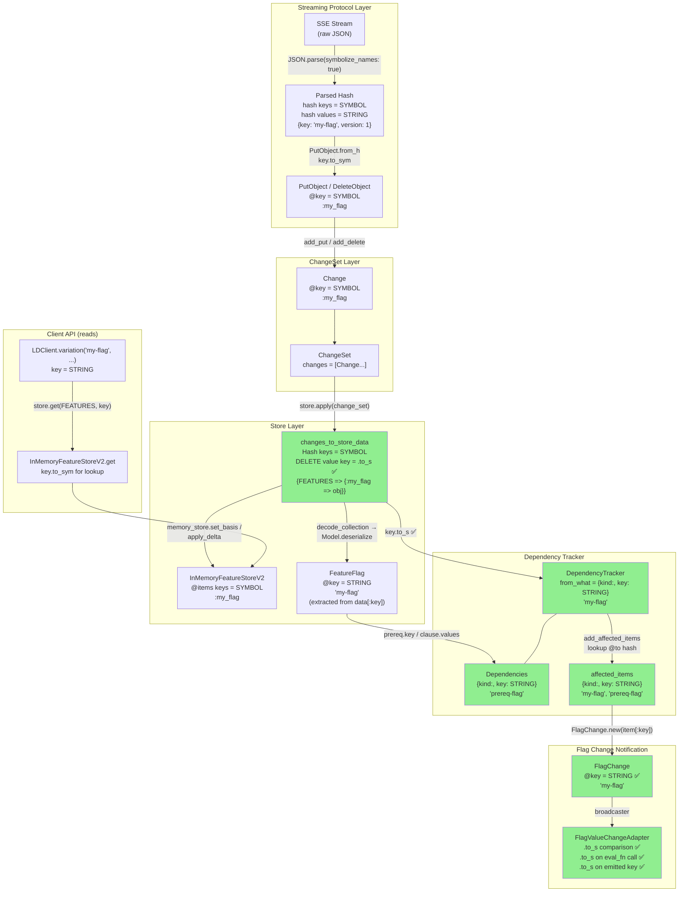
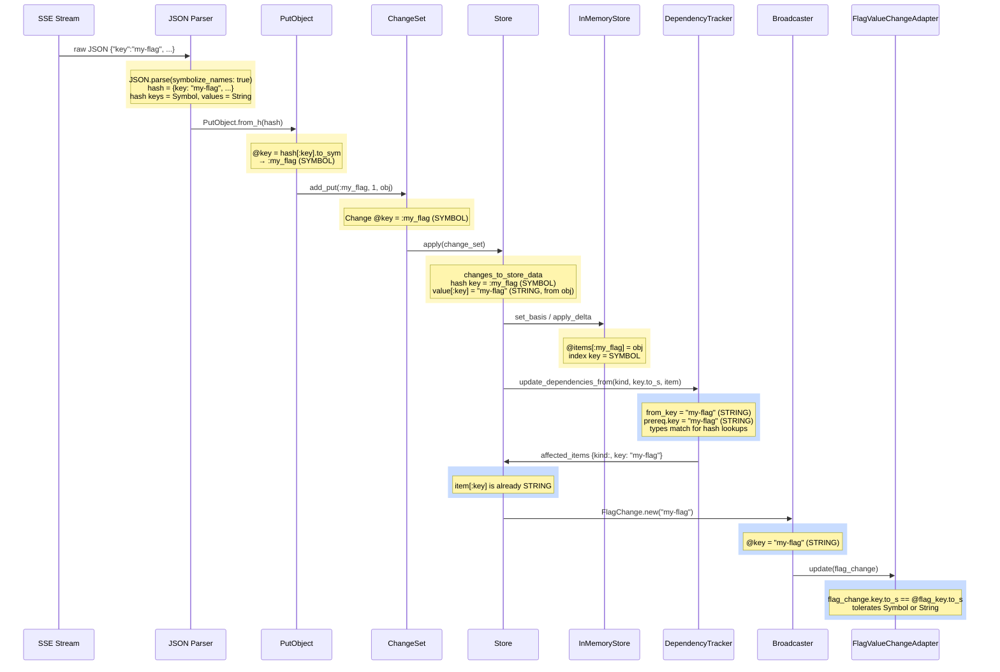
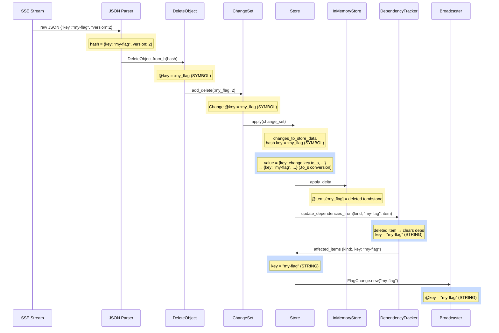
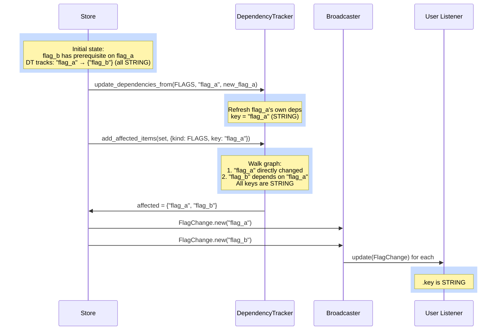
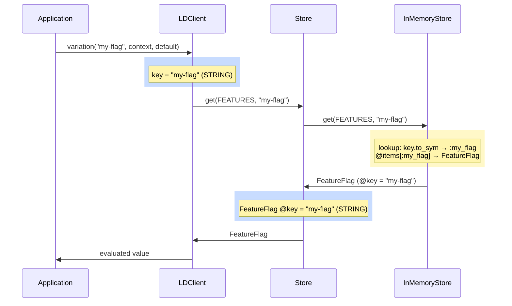

# FDv2 Key Type Flow

## Data Pipeline

## Sequence Diagrams

These show the key type at each handoff point, with `.to_s` conversions marked.

**Legend:** Yellow background = key is a **Symbol**, Blue background = key is a **String**.

### PUT flow (flag received from stream)

### DELETE flow (flag deleted from stream)

### Dependency propagation (prerequisite change)

### Client read path (variation call)

## Two Distinct Key Concepts

| Concept | Type | Example | Where |
|---|---|---|---|
| **Hash key** in collections (how items are indexed in the store) | **Symbol** | `:my_flag` | `changes_to_store_data`, `InMemoryFeatureStoreV2.@items` |
| **Flag key** as a value (the flag's identifier string) | **String** | `"my-flag"` | `FeatureFlag#key`, `Prerequisite#key`, `LDClient.variation`, `FlagChange#key`, `FlagValueChange#key` |

## The Fix

1. **DELETE path** — `changes_to_store_data` now uses `.to_s` on the `:key` value field of fabricated delete hashes, matching PUT objects which carry String keys from JSON.

2. **Dependency tracker boundary** — keys are converted with `.to_s` when passed from the store to the dependency tracker, ensuring hash lookups match between items indexed by `change.key` (Symbol) and dependencies extracted from model objects (String).

3. **FlagValueChangeAdapter** — uses `.to_s` on both sides of comparisons and on the key passed to `eval_fn` and emitted in `FlagValueChange`. Users can pass either Symbol or String to `add_flag_value_change_listener`.

4. **Interface docs** — `FlagChange`, `FlagValueChange`, and `add_flag_value_change_listener` document `[String]` keys. Internal `Change` class documents that its Symbol key is converted to String at user-facing boundaries.
